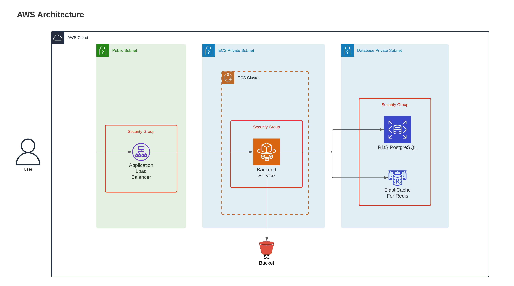

# LiteralAI on AWS

## Prerequisites

- Node.js 14.15.0 or later

## Setup

1. Clone this repository
2. [Create an AWS account](https://docs.aws.amazon.com/IAM/latest/UserGuide/getting-set-up.html#sign-up-for-aws)
3. [Install AWS CLI](https://docs.aws.amazon.com/cli/latest/userguide/cli-chap-install.html)
4. [Configure AWS CLI](https://docs.aws.amazon.com/cdk/v2/guide/getting_started.html#getting_started_auth) `aws configure`
5. `npm install` to install the required dependencies
6. [Bootstrap](https://docs.aws.amazon.com/cdk/latest/guide/bootstrapping.html) your environment `cdk bootstrap aws://ACCOUNT-NUMBER/REGION`

- `aws sts get-caller-identity` to get your AWS account number
- `aws configure get region` to get your AWS region

## Deploy

7. [Get your Docker Personal Access Token (PAT)](https://docs.getliteral.ai/self-hosting/get-started)
8. Deploy the infra: `npx cdk deploy --all --parameters EcsStack:dockerPat=LITERAL_DOCKER_PAT`

You should now be able to see the Literal sign in page.

## Configure HTTPs

AWS load balancers are not using HTTPs by default. To enable HTTPs (best practice and needed for OAuth):

1. Create a certificate on AWS (you will have to update your domain DNS)
2. Add an HTTPs listener to the load balancer using that certificate
3. Allow port 443 in the security group
4. Add a CNAME record redirecting your subdomain to the Load Balancer public URL.

You should now be able to access Literal with HTTPs through your subdomain.

## Setup OAuth

Create a new task revision with `NEXTAUTH_URL` set to your HTTPs endpoint (like `https://literalai.mydomain.com`).

Then add the required [env variables](https://docs.getliteral.ai/self-hosting/deployment#provider-specific) specific to your OAuth provider.

Do not forget to allow the OAuth redirect url on your OAuth provider (like `https://literalai.mydomain.com/api/auth/callback/google`)

Finally, update your container with the latest revision.

## AWS CDK Useful commands

- `npm run build` compile typescript to js
- `npm run watch` watch for changes and compile
- `npm run test` perform the jest unit tests
- `npx cdk deploy` deploy this stack to your default AWS account/region
- `npx cdk diff` compare deployed stack with current state
- `npx cdk synth` emits the synthesized CloudFormation template
